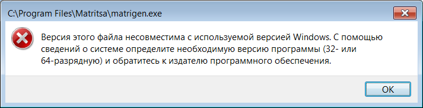
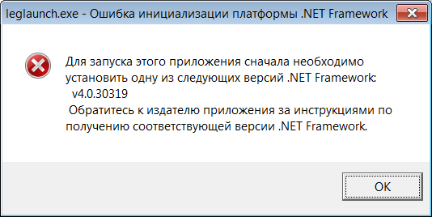
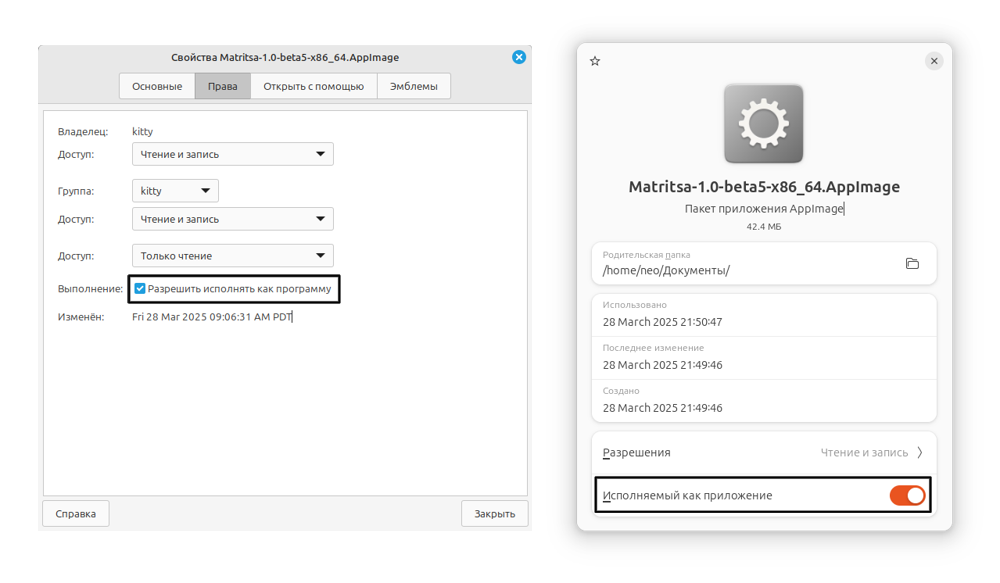
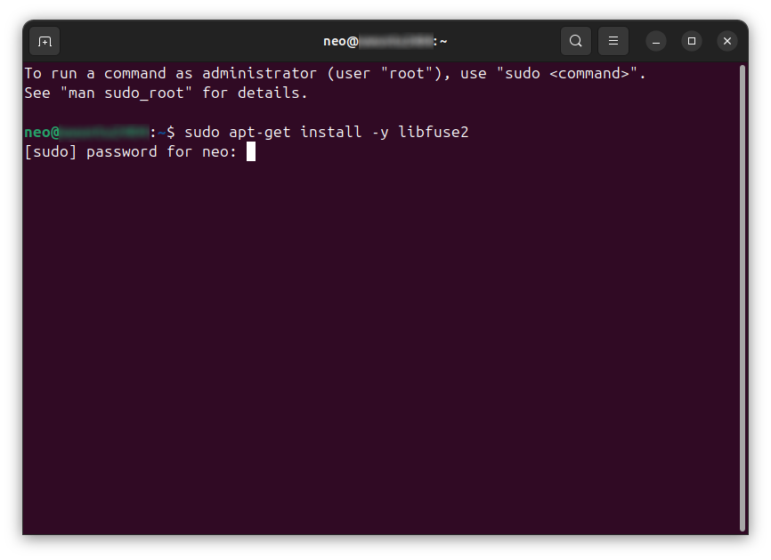

# Проблемы с запуском Матрицы
## Проблемы на Windows
### Ошибка "Версия этого файла несовместима с используемой версией Windows"

Установите программу для запуска Матрицы на старых компьютерах. В большинстве случаев она устанавливается автоматически.
### Ошибка инициализации платформы .NET Framework

Установите [.NET Framework 4](https://dotnet.microsoft.com/en-us/download/dotnet-framework/thank-you/net40-offline-installer).
### Ошибка, связанная с файлом `api-ms-win-crt-runtime-l1-1-0.dll`
Установите [распространяемый пакет Visual C++ для Visual Studio 2015](https://www.microsoft.com/en-US/download/details.aspx?id=48145). В большинстве случаев он устанавливается автоматически.

## Проблемы на Linux
### Файл не запускается
Скорее всего, нужно открыть свойства файла (в меню, которое открывается, если правой кнопкой мыши выбрать файл) и включить пункт, разрешающий исполнение программы. Название этого пункта меняется в зависимости от системы.

Если вы используете ОС Ubuntu, надо установить недостающий пакет FUSE:
- Откройте терминал.
- Напишите `sudo apt install -y libfuse2`.
- По запросу напишите свой пароль (внимание: пароль не отображается во время ввода).
- Закройте терминал.

